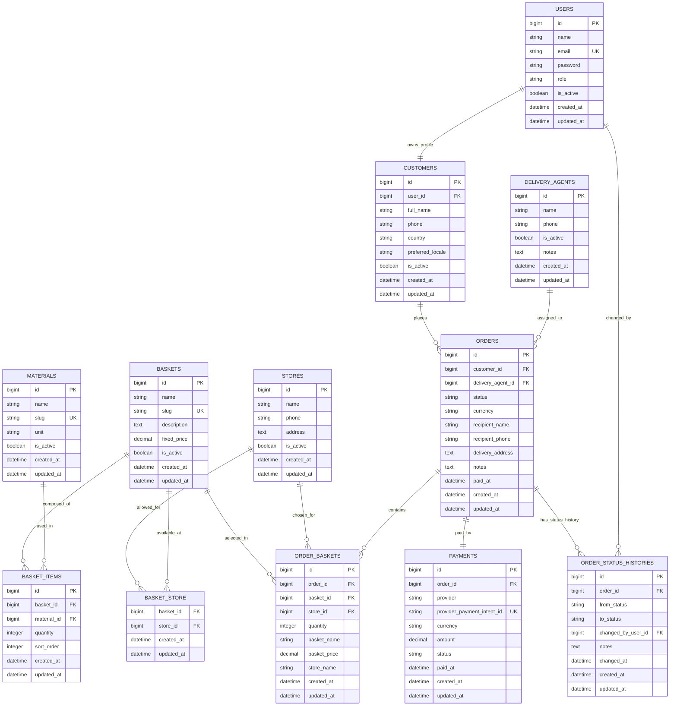

# ERD Only

```mermaid
erDiagram
    USERS {
        bigint id PK
        string name
        string email UK
        string password
        string role
        boolean is_active
        datetime created_at
        datetime updated_at
    }

    CUSTOMERS {
        bigint id PK
        bigint user_id FK
        string full_name
        string phone
        string country
        string preferred_locale
        boolean is_active
        datetime created_at
        datetime updated_at
    }

    BASKETS {
        bigint id PK
        string name
        string slug UK
        text description
        decimal fixed_price
        boolean is_active
        datetime created_at
        datetime updated_at
    }

    MATERIALS {
        bigint id PK
        string name
        string slug UK
        string unit
        boolean is_active
        datetime created_at
        datetime updated_at
    }

    BASKET_ITEMS {
        bigint id PK
        bigint basket_id FK
        bigint material_id FK
        integer quantity
        integer sort_order
        datetime created_at
        datetime updated_at
    }

    STORES {
        bigint id PK
        string name
        string phone
        text address
        boolean is_active
        datetime created_at
        datetime updated_at
    }

    BASKET_STORE {
        bigint basket_id FK
        bigint store_id FK
        datetime created_at
        datetime updated_at
    }

    DELIVERY_AGENTS {
        bigint id PK
        string name
        string phone
        boolean is_active
        text notes
        datetime created_at
        datetime updated_at
    }

    ORDERS {
        bigint id PK
        bigint customer_id FK
        bigint delivery_agent_id FK
        string status
        string currency
        string recipient_name
        string recipient_phone
        text delivery_address
        text notes
        datetime paid_at
        datetime created_at
        datetime updated_at
    }

    ORDER_BASKETS {
        bigint id PK
        bigint order_id FK
        bigint basket_id FK
        bigint store_id FK
        integer quantity
        string basket_name
        decimal basket_price
        string store_name
        datetime created_at
        datetime updated_at
    }

    ORDER_STATUS_HISTORIES {
        bigint id PK
        bigint order_id FK
        string from_status
        string to_status
        bigint changed_by_user_id FK
        text notes
        datetime changed_at
        datetime created_at
        datetime updated_at
    }

    PAYMENTS {
        bigint id PK
        bigint order_id FK
        string provider
        string provider_payment_intent_id UK
        string currency
        decimal amount
        string status
        datetime paid_at
        datetime created_at
        datetime updated_at
    }

    USERS ||--|| CUSTOMERS : owns_profile
    CUSTOMERS ||--o{ ORDERS : places
    BASKETS ||--o{ BASKET_ITEMS : composed_of
    MATERIALS ||--o{ BASKET_ITEMS : used_in
    STORES ||--o{ BASKET_STORE : allowed_for
    BASKETS ||--o{ BASKET_STORE : available_at
    BASKETS ||--o{ ORDER_BASKETS : selected_in
    STORES ||--o{ ORDER_BASKETS : chosen_for
    DELIVERY_AGENTS ||--o{ ORDERS : assigned_to
    ORDERS ||--o{ ORDER_BASKETS : contains
    ORDERS ||--o{ ORDER_STATUS_HISTORIES : has_status_history
    USERS ||--o{ ORDER_STATUS_HISTORIES : changed_by
    ORDERS ||--|| PAYMENTS : paid_by
```
