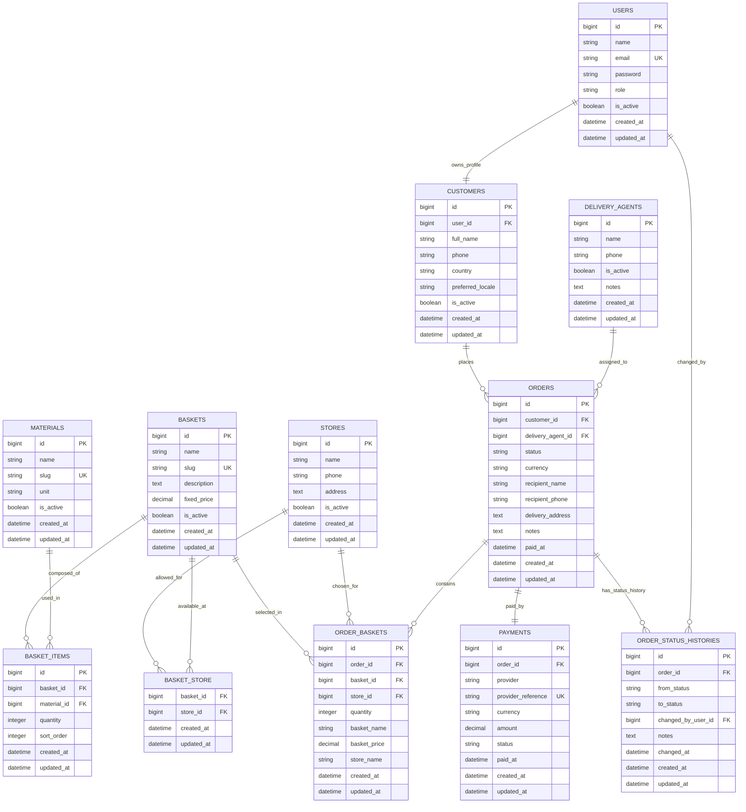

# ERD

This ERD is derived from [admin-functional-requirements.md](./admin-functional-requirements.md) and the original MVP requirements.

## Design Decisions

- `users` stores authentication and authorization data.
- `customers` stores customer domain data and links one-to-one with `users`.
- `recipients` are not stored as a separate entity because the requirements say recipients do not interact with the system.
- `delivery_agents` are modeled separately from `users` because the current MVP only requires manual assignment and operational access, not full customer-style authentication.
- `materials` is the reusable catalog of basket components.
- `basket_items` defines the composition of each basket and the quantity of each material inside it.
- `orders` is the order header and operational workflow record.
- `order_baskets` stores the baskets selected within an order.
- Historical basket/store values are kept on `order_baskets` without using `_snapshot` naming.
- `order_status_histories` makes status changes auditable.
- `payments` is modeled separately to keep Ziina-related data isolated from operational order data.

## Mermaid ER Diagram

## Entity Notes

### `users`

- Stores authentication credentials and authorization data.
- Suggested role values: `admin`, `customer`.

### `customers`

- Stores customer-specific business data separately from authentication.
- Links one-to-one with `users`.
- Allows `orders.customer_id` to point to a dedicated customer entity instead of a generic user row.

### `baskets`

- Represents a predefined basket with a fixed total price.
- `is_active` controls whether it can be shown to customers for new orders.
- Basket composition is defined through `basket_items`.

### `materials`

- Reusable catalog of grocery materials or components.
- Intended to avoid retyping the same item names across baskets.

### `basket_items`

- Join table between `baskets` and `materials`.
- Stores the quantity of each material included in a basket.
- `sort_order` controls display order inside a basket.

### `stores`

- Represents approved physical stores in Syria.
- Stores are linked to baskets through `basket_store`.

### `basket_store`

- Many-to-many pivot between baskets and stores.
- Enforces the rule that customers may only order a basket from one of its approved stores.

### `delivery_agents`

- Stores the delivery workforce managed manually by admins.
- `is_active` controls whether an agent can receive new assignments.

### `orders`

- Central operational entity and order header.
- Contains recipient information because recipients do not use the system directly.
- Stores customer, recipient, assignment, payment timing, and status data.

### `order_baskets`

- Join table between `orders` and `baskets`.
- Supports one order containing multiple baskets.
- Stores historical basket/store values at order time without `_snapshot` suffixes:
  - `basket_name`
  - `basket_price`
  - `store_name`

### `order_status_histories`

- Audit table for order lifecycle changes.
- Supports reliable status tracking and admin traceability.

### `payments`

- Keeps payment provider information separate from order operations.
- Recommended provider value in MVP: `ziina`.

## Recommended Constraints

- Unique index on `customers.user_id`.
- Unique index on `materials.slug`.
- Unique composite index on `basket_items (basket_id, material_id)`.
- Unique composite index on `basket_store (basket_id, store_id)`.
- Foreign key from `order_baskets.store_id` must reference a store allowed for the selected basket at creation time.
- Unique composite index on `order_baskets (order_id, basket_id, store_id)` if duplicate lines should be prevented.
- Only active delivery agents should be assignable to new orders.
- `payments.order_id` should be unique for MVP one-payment-per-order behavior.
- `orders.status` should be limited to `pending`, `assigned`, `in_progress`, `delivered`, `cancelled`.

## Open Decisions Before Migrations

- Whether to use soft deletes on `baskets`, `stores`, and `delivery_agents`.
- Whether to use soft deletes on `materials`.
- Whether `customers` should store additional contact metadata beyond phone and locale.
- Whether `delivery_agents` should later become authenticatable users.
- Whether an order may contain the same basket more than once as separate lines or should use quantity aggregation.
- Whether `materials.unit` should be free text or a controlled list.
- Whether failed Ziina attempts should be stored in a separate `payment_attempts` table.
